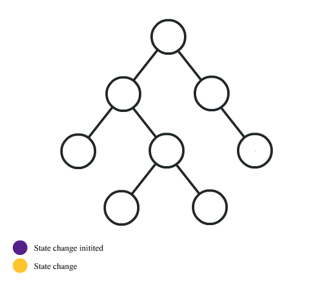

# Context API

Context API를 알아보기 이전 Context를 사용하지 않는 리액트에서 State 관리를 어떻게 했는지 알아봅시다.



React는 State를 관리하기 위해 상위 컴포넌트에서 State을 선언하고 이를 자식 컴포넌트로 전달하면서 State를 관리할 수 있습니다. 이러한 구조는 같은 State이지만 매번 자식 컴포넌트에게 전달 시키도록 하는 의미없는 코드 작성을 통해 컴포넌트의 코드는 지저분해지는 것을 쉽게 경험할 수 있습니다.

> 이렇게 하위 컴포넌트로 전달 하는 State를 prop drilling이라고도 합니다.

이러한 의미없는 코드 작성을 방지하고 좀 더 효율적으로 React 앱 전반에 사용되는 데이터를 관리하고 사용할 수 있도록 React는 ContextAPI를 제공하고 있습니다. 이 ContextAPI는 React 16.3 버젼부터 제공되고 있습니다.

## Context API Methods

React Context API는 다음의 메소드를 이용해 사용할 수 있습니다.

- React.createContext: Context 오브젝트를 생성할 때 사용합니다.
- Context.Provider: 하위 컴포넌트가 Context를 사용할 수 있도록 만들어 줍니다.
- Context.Consumer: props drilling 없이도 Context에 저장된 State를 사용할 수 있도록 합니다.

Context를 사용하기 위해서는 Value를 지정해주어야 합니다. 이 Value는 아래의 2가지 방법으로 줄 수 있습니다. 코드를 통해 확인해 봅시다.

```javascript
import { createContext, useContext } from "react";

// 기본 값 지정 이는 일반적인 Hook을 사용할때와 같습니다.
const Context = createContext("Default Value");

function Child() {
  const context = useContext(Context);
  return <h2>Child1: {context}</h2>;
}

function Child2() {
  const context = useContext(Context);
  return <h2>Child2: {context}</h2>;
}

function App() {
  return (
    <>
      <Context.Provider value={"Initial Value"}>
        <Child /> {/* Child 컴포넌트에서는 Intitial Value 값을 받게 됩니다.*/}
      </Context.Provider>
      <Child2 /> {/* Provider Wrap 밖에서는 Defalut Value를 받게됩니다. */}
    </>
  );
}
```

DefaultValue의 경우 Provider를 찾지 못했을 때 사용하는 값입니다.

## 코드

먼저 Context를 사용하기 위해서 일반적으로 Context의 틀을 아래와 같이 구성합니다.

```javascript
import { createContext } from "react";

const ThemeContext = createContext({
  isDark: false,
  changeTheme: () => {},
});

export default ThemeContext;
```

위 파일은 단순한 틀이며 절대 Context 값과 관련이 없습니다. createContext 메소드 안에 파라미터를 모두 지운다고 해도 코드는 정상적으로 작동합니다.

Context의 값을 할당하기 위해서는 위에서 잠깐 본 defaultValue 또는 InitialValue를 설정해주어야 합니다. Static한 State의 경우 Provider 에 value 파라미터로 static한 값을 넘겨주면 되지만, 유동적으로 변하는 Immutable State의 경우 useState Hook을 이용해 changeFunction과 value값을 주는 것으로 합니다.

위 설명을 아래의 코드로써 표현할 수 있습니다.

```javascript
function App() {
  const [isDark, setDark] = useState(false);
  const changeTheme = () => {
    setDark((prev) => !prev);
  };
  return (
    <ThemeContext.Provider value={{ isDark, changeTheme }}>
      <UserDataConText.Provider value={{}}>
        <>
          <Header />
          <Outlet />
        </>
      </UserDataConText.Provider>
    </ThemeContext.Provider>
  );
}
export default App;
```

이렇게 된다면 이전에 본 React의 렌더링 기준 조건에 의해 State가 변경되면 자식 Component가 다시 렌더링 되어 변경된 State값을 표현할 수 있습니다.

## Redux

Context도 매우 훌륭한 API입니다. 하지만, Context의 간단한 앱의 경우 Context의 Context Provider Soup에 빠지는 일은 없지만, 규모가 큰 React의 경우 수많은 Provider 그리고 Provider 간의 의존성을 고려해야 하므로 설계가 복잡해 질 수 있습니다.

또한 Context를 사용하게 된다면, Provider의 위치 그리고 각 Provider에 제공되는 값들을 Hook으로 설정해야 하는 번거로움이 존재합니다.

이러한 불편을 해결하기 위해 개발자들은 Redux를 개발했고 이를 현재 사용중에 있습니다.

### Redux 설치

```bash
# NPM
npm install redux

# Yarn
yarn add redux
```

```javascript
import { createStore } from 'redux'

function counter(state = 0, action) {
  switch (action.type) {
    case 'INCREMENT':
      return state + payload?? 1
    case 'DECREMENT':
      return state - 1
    default:
      return state
  }
}

let store = createStore(counter)

store.subscribe(() => console.log(store.getState())))

store.dispatch({ type: 'INCREMENT', payload: 2 })
store.dispatch({ type: 'INCREMENT' })
store.dispatch({ type: 'DECREMENT' })
```

Javascript 파일을 하나 만들고 위의 코드를 작성해봅시다.

작성 한 후

```bash
node redux.js # 만든 파일 이름
```
