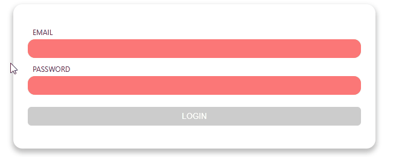

# React Fragment Ref StyledComponent

## Fragment

실제 리액트 프로젝트를 하다보면 DIV SOUP에 빠지게 됩니다. 이렇게 빠지게 된 이유는 React의 구조에서 비롯된 문제입니다. 리액트는 아래의 예제와 같이 하나의 컴포넌트를 반환해야 하는 원칙을 가지고 있습니다. 하지만 리액트의 원칙이라고 하지만 자세히 살펴본다면 Javascript의 한계이기도 합니다.

특정 언어는 리턴 값을 2개를 줄 수 있는 언어도 있습니다. 하지만 Javascript의 경우 한개의 리턴값만을 반환할 수 있도록 설계된 언어입니다. 따라서 아래의 예제외 같이 두개의 리턴 값을 준다는 것은 언어의 설계에 **반하는** 코드입니다. 리액트에서는 원칙이라고 말하지만 이는 내부로 들어가면 Javascript 언어의 설계를 따라가는 문제입니다.

```JSX
const component = props => {
    return (
        <div id="wrap">
            Hello React
        </div>
    )
}

// JSX를 JS로 바꾸면 다음과 같습니다.
// React.createElement(component, props, ...children)
return
React.createElement('div', {id:'wrap'}, 'Hello React1')
React.createElement('div', {id:'wrap'}, 'Hello React2')

/*
아래의 예제는 에러가 발생합니다.
const component = props => {
    return (
        <div>
            Hello React
        </div>
        <div>
            <span>Hello World</span>
            <span>Hello World2</span>
        </div>
    )
}
*/
```

이런식으로 React Component를 지속적으로 만들어 웹페이지를 만든다면 DIV SOUP이 형성됩니다. 이렇게 형성된 DIV SOUP은 성능적인 문제 그리고 웹페이지의 구성을 복잡하게 만들어 지양해야 할 구조입니다. 이러한 문제를 해결하기 위해 React에서는 **_Fragment_** 를 제공합니다.

**_Fragment_**는 다음과 같이 사용할 수 있습니다.

```JSX
const app = props => {
    return (<React.Fragment>
        ...
    </React.Fragment>)
}

// 또는

const app = props => {
    return (<>
    ...
    </>)
}

// 간혹 React에서 제공하는 Fragment를 사용하지 않고 Component를 만들어 Fragment를 만들기도 합니다.

const app = props => {
    return ({props.children})
}
```

위의 방법 중 원하는 방법을 통해 UI를 만들어 보고 DIV로 wrap했을때와 Fragment로 Wrap했을 때에 다른 점을 확인해 봅시다.

## Ref

일반적으로 Javascript를 이용해 Html 엘레멘트를 접근하기 위해서는 DOM API를 이용해 접근하게 됩니다. 그렇다면 React에서는 어떻게 접근할 수 있을까요? JSX코드에서 id를 선언하고 Javascript의 DOM API를 이용해 접근할 수도 있습니다. 하지만 이렇게 접근하여 값을 변경하는 경우 리액트에서 관리하지 않는 _uncotrolled_ 상태가 됩니다. 리액트에서는 친절하게도 이러한 기능을 리액트를 통해서 제공합니다.

```JSX
import React,{useRef} from 'react'


const app = props => {
    const r = useRef()

    const refChecker = () => {
        console.log(r)
        console.log(r.current)
    }

    return <div>
        <input type="text" ref={r}>
        <button onClick={refChecker}>
    </div>
}
```

**_Ref_** 는 하나의 값만을 반환합니다. 이 반환된 값을 JSX의 HTML 엘레멘트에 지정해줌으로서 연결할 수 있습니다. 위의 예제를 실행해 어떠한 값이 반환되는지 확인해 봅시다.

### Foward Ref

매우 적은 경우로 반복적으로 사용하는 컴포넌트 안의 HTML 엘레멘트를 지정해야 할 필요가 생길 수 있습니다. 기본적으로 Ref는 속성값으로 넘길 수 없지만 FowardRef를 사용하면 속성값을 넘길 수 있습니다.

다음의 상황을 가정해봅시다. 로그인하는 폼이 있고 폼의 내용이 적절하지 않을 경우 focus하는 폼을 만든다고 생각해봅시다.

물론 id를 지정해주어 foucs를 할 수 있겠지만 이러한 작업은 매우 번거롭기 떄문에 적절하지 않을 수 있습니다. 그래서 다음의 코드를 이용해 할 수 있습니다.

```JSX
// App.js
import { useRef } from 'react'
import './App.css'
import Input from './Components/Input'

function App() {
  const r = useRef()

  const eventHandler = (e) => {
    e.preventDefault()

    if (r.current.value.trim().length === 0) {
      r.current.focus()
    }
  }

  return (
    <>
      <form onSubmit={eventHandler}>
        <Input label="id" ref={r} type="text" />
        <input type="submit" value="Submit" />
      </form>
    </>
  )
}

export default App

```

```JSX
// Input.js
import React from 'react'

const Input = React.forwardRef((props, ref) => {
  let random = Date.now()
  return (
    <React.Fragment>
      <label htmlFor={random}>{props.label}</label>
      <input ref={ref} type={props.type} id={random} />
    </React.Fragment>
  )
})
export default Input

```

## Styeld Component

react 개발자들이 가장 많이 사용하는 방법 중 하나는 Styled Component를 이용하는 방법입니다. 이를 사용하기 위해서는 먼저 패키지 설치가 필요합니다.

```bash
npm install styled-components

# or

yarn add styled-components
```

그리고 다음의 예제를 실행해봅시다.

```JSX
// App.js
import './App.css'
import Button from './Button'

function App() {
  return (
    <>
      <Button>props</Button>
      <Button primary>props</Button>
    </>
  )
}

export default App

```

```JSX
// Button.js
import React from 'react'
import styled, { css } from 'styled-components'

const StyledButton = styled.button`
  background: transparent;
  border-radius: 3px;
  border: 2px solid palevioletred;
  color: palevioletred;
  margin: 0.5em 1em;
  padding: 0.25em 1em;

  ${(props) =>
    props.primary &&
    css`
      background: palevioletred;
      color: white;
    `}

  &:hover {
    background-color: black;
  }
`

const Button = (props) => {
  return <StyledButton {...props}>
    {props.children}
  </StyledButton>
}

export default Button

```

styled components를 사용하지 않고 css를 module화 해서 하는 방법도 있습니다.

```JSX
// App.js
import './App.css'
import Button from './Button'

function App() {
  return (
    <>
      <Button>props</Button>
      <Button primary>props</Button>
    </>
  )
}

export default App

```

```JSX
// Button.js
import React from 'react'
import st from './Button.module.css'

const Button = (props) => {
  return (
    <button className={`${st.button} ${(props.primary && st.primary) ?? ''}`}>
      {props.children}
    </button>
  )
}

export default Button

```

```CSS
/*Button.module.css*/
.button {
  background: transparent;
  border-radius: 3px;
  border: 2px solid palevioletred;
  color: palevioletred;
  margin: 0.5em 1em;
  padding: 0.25em 1em;
}
.button:hover {
  background-color: black;
}

.primary {
  background: palevioletred;
  color: white;
}

```

와 같이 구성하면 똑같은 기능을 하는 스타일링을 할 수 있습니다.

## 실습

로그인 폼을 만들어 봅시다! 가능하다면 오늘 배운 내용을 모두 사용하여 폼을 만들어 봅시다

---

### 요구사항

1. Card, Input와 같이 재사용할 수 있는 컴포넌트를 만든다.
2. Styled-Component 또는 CSS Module을 이용해 스타일을 적용한다.
3. useEffect를 이용해 폼 값이 적절한지 확인한다.
4. 폼을 제출할 때에 값이 비어있다면 빈 인풋 값이 있는 엘레멘트에 포커싱을 할 수 있도록 한다.

#### 예제화면


