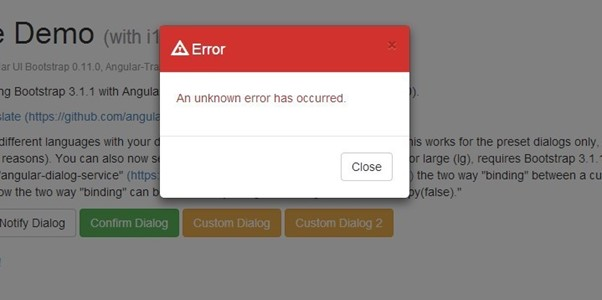
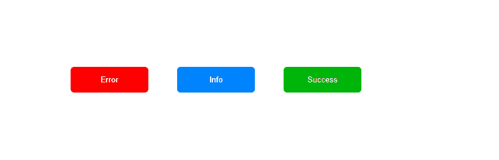

# Portal

일반적으로 대부분의 FE 라이브러리들은 하나의 HTML 엘레멘트를 Root엘레멘트로 설정하고 Root 엘레멘트를 기준으로 HTML엘레멘트를 추가하거나 변경하여 동적인 웹페이지를 만들게 됩니다.

React Library 역시도 다음과 같은 구문을 통해 Root엘레멘트를 설정하고 컴포넌트를 추가해 웹페이지 구성합니다.

```JS
ReactDOM.render(
  <React.StrictMode>
    <App />
  </React.StrictMode>,
  document.getElementById('root')
);
```

하지만 이러한 구조안에서 PopUp 또는 Modal을 구현할 때에는 이러한 구조가 적절하지 않을 수 있습니다.



Modal이나 PopUp의 경우 렌더링 된 웹페이지의 제일 상단에 위치해야 하기에 CSS의 z-index를 이용해 최상단으로 끌어올릴 수도 있습니다. 하지만 이와 더불러 Root 엘레멘트와 같은 레벨의 엘레멘트에 바인딩하는 것이 적절하기에 React에서는 Portal이라는 기능을 통해 위의 구조를 구현할 수 있도록 만들었습니다.

## Modal

그렇다면 먼저 Modal에 대해 먼저 알아봅시다. 이전 IE가 주류인 인터넷세상에는 PopUp을 이용해 추가적인 정보를 사용자에게 제공하곤 했습니다. 하지만 이러한 PopUp이 보안에 굉장히 취약하고 무분별한 팝업을 통해 사용자의 불편을 초래한다는 의견이 많아 IE를 제외한 모든 브라우저에서 이러한 팝업을 기본적으로 차단하도록 설정한 이후 Modal과 같은 기술이 만들어졌습니다.

먼저 Modal을 HTML CSS를 이용해 만들어봅시다. [모달예제코드](./example/modal_example/modal.html)

> 코드를 보면서 모달을 어떻게 만들 수 있는지 확인해 봅시다!

## React Portal

React에서도 위의 예제와 같은 HTML구조로 만들어 가용성이 넓게 구성하는 것이 좋은 코드입니다. 그렇다면 실제로 리액트에서는 어떻게 위의 예제와 같은 구성을 만들 수 있는지 확인해 봅시다!

먼저 리액트 프로젝트 Public 폴더의 [Index.html](./public/index.html) 파일에 Portal을 위한 엘레멘트를 하나 생성합니다. id값은 원하는 값으로 줄 수 있으며 root엘레멘트의 위 아래 어느 위치든 상관 없이 element를 만들면됩니다.

```HTML
  ...
    <div id="portal"></div>
    <div id="root"></div>
  ...
```

아래와 같이 element를 만들었다면 Portal을 위한 Component를 다음과 같이 만들어 줍니다. createPortal함수의 경우 첫번째 파라미터에는 Component의 children, 두번째 파라미터에는 위의 Portal을 위한 index.html에서 만든 Element id값을 넣어 줍니다.

```JSX
import ReactDOM from 'react-dom'

const Portal = (props) => {
  return ReactDOM.createPortal(
    props.children,
    document.getElementById('portal'),
  )
}

export default Portal

```

이제 이 컴포넌트를 이용해서 Modal을 이용할 수 있습니다. [ReactModal예제](./example/react-modal-example/)를 참고해서 Portal에 대해 확실하게 이해해 봅시다!

### 실습

Portal을 이용해 다음과 같은 기능을 하는 웹페이지를 만들어봅시다!

