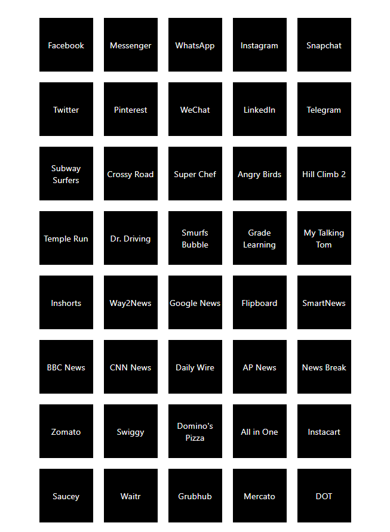
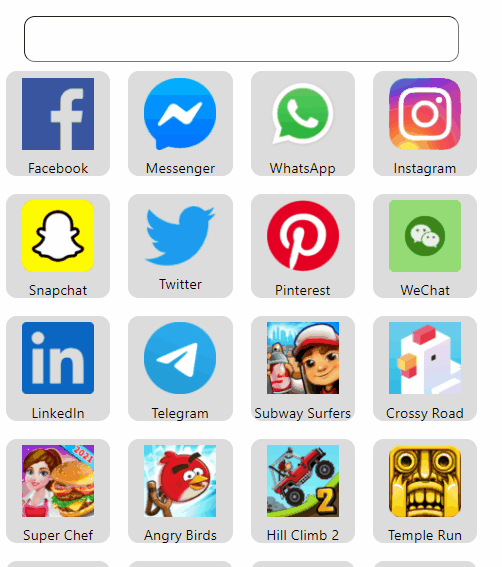

## **React Props를 이용해 앱을 만들어 봅시다!**

1. Box 컴포넌트와 SNSData를 이용해 appName을 출력하는 앱을 만들어봅시다!

> 스타일은 그대로 두고 작업하셔도 무방합니다. 더 멋진 스타일을 원하실 경우 스타일도 바꿔보세요! 
> React의 사상 중 컴포넌트화를 위해 Box를 하나의 컴포넌트로 선언하고 불러오는 방법으로 앱을 만들어 봅시다!

2. (심화) Box컴포넌트에 imageUrl과 appName을 이용해 샘플과 같이 만들어 봅시다!
3. (심화) appName을 적을 수 있는 input을 이용해 앱을 필터링 해봅시다!
> javascript filter함수 이용

