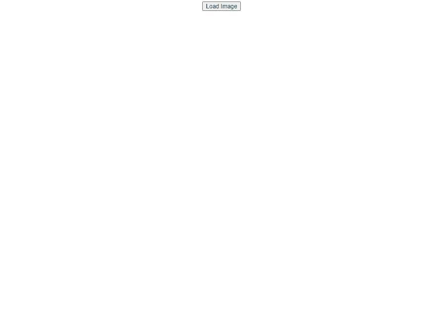

## props와 인터넷 통신

FrontEnd를 직무로서 삼게된다면 통신은 필수적으로 다룰줄 알아야 합니다. 그렇기에 이번에는 통신을 통해 이미지를 불러오는 작업을 해보도록 하겠습니다. 다양한 비동기 통신을 이용한 다양한 라이브러리를 찾아보고 다음의 URL: https://randomfox.ca/floof/?ref=apilist.fun 을 이용해 이미지를 불러와 봅시다!

1. 비동기통신을 이용해 이미지를 불러와 봅시다!
> AJAX, AXIOS, FETCH 등... 
> 가능하다면 컴포넌트를 만드는 연습도 해봅시다!
기능은 다음과 같이 버튼을 누르면 이미지가 바뀌는 앱입니다.

